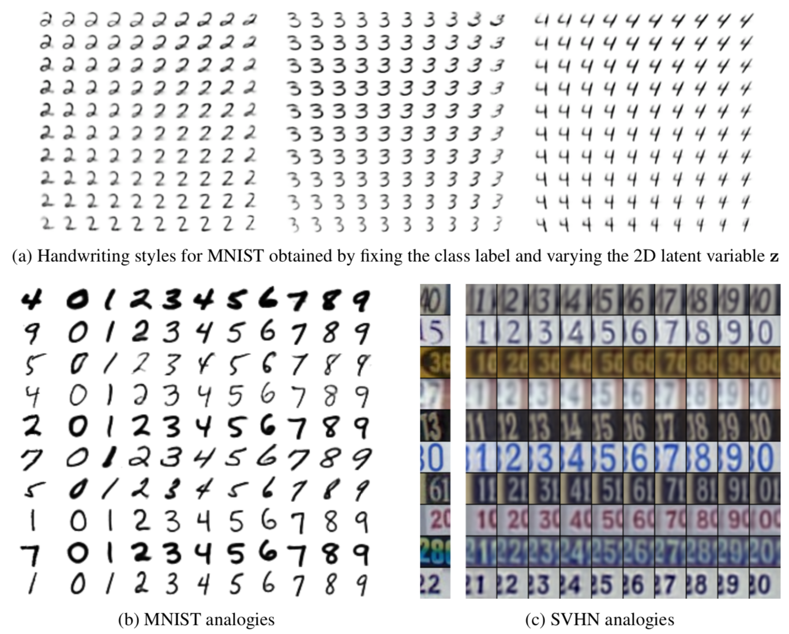

# Semi-supervised Learning

Collection of implementations of modern semi-supervised learning methods using deep learning including variational
models.

The models and and methods are implemented in the folder `semi`. The folder `examples` has notebook that use them in
example applications.

## Semi-supervised learning

Semi-supervised learning hybrid approach that combines supervised and unsupervised learning to learn from both
labelled and unlabelled data.

Semi-supervised learning can typically be applied to areas where data is easy to get a hold of, but labelling is expensive.
Normally, one would either use an unsupervised method, or just the few labelled examples. The promise of semi-supervised
learning is that by including both the labelled and unlabelled data, a model can improve beyond

The current state-of-the-art method in semi-supervised learning achieves an accuracy of over 99% on the MNIST dataset
using just **10 labelled examples per class**.

## Conditional generation

Most semi-supervised models simultaneously train an inference network and a generator network. This means that it is 
not only possible to query this models for classification, but also to generate new data from trained model.
By seperating label information, one can generate a new sample with the given digit as shown in the image below from
Kingma 2014.



## Implemented models and methods

* [Variational Autoencoder (Kingma 2013)](https://arxiv.org/abs/1312.6114)
* [Importance Weighted Autoencoders (Burda 2015)](https://arxiv.org/abs/1509.00519)
* [Variational Inference with Normalizing Flows (Rezende & Mohamed 2015)](https://arxiv.org/abs/1505.05770)
* [Semi-supervised Learning with Deep Generative Models (Kingma 2014)](https://arxiv.org/abs/1406.5298)
* [Auxiliary Deep Generative Models (Maaløe 2016)](https://arxiv.org/abs/1602.05473)
* [Ladder Variational Autoencoders (Sønderby 2016)](https://arxiv.org/abs/1602.02282)
* [β-VAE (Higgins 2017)](https://openreview.net/forum?id=Sy2fzU9gl)

## Installation

```bash
conda create -y -n semi python==3.7 nb_conda
conda activate semi
pip install --upgrade --editable .
```

## References
[1] `semi-supervised-pytorch`. Wohlert. GitHub repository. https://github.com/wohlert/semi-supervised-pytorch
