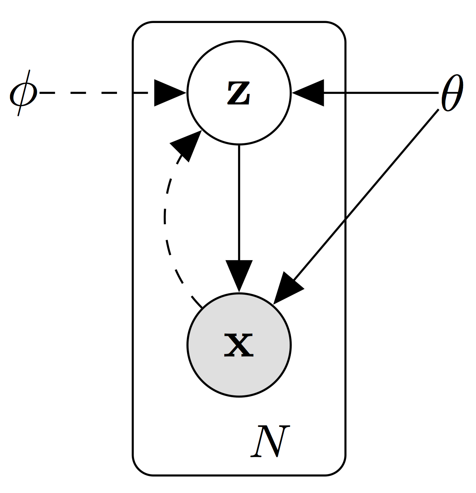

# Variational Inference

Variational learning finds the parameters $\theta$ of a distribution on the weights $q_\theta(w)$ that minimises the Kullback-Leibler ($KL$) divergence with the true Bayesian posterior on the weights $p(w|x)$ , which is intractable in practice.

## Mean-Field Approximation

One of the most common and popular forms of variational inference is the Mean-Field approximation (Opper and Saad 2001).

### Bayes' rule
$$
p(Z|X) = \frac{p(X|Z)p(Z)}{p(X)}
$$

$p(Z|X)$ is the **posterior probability**: "given the image, what is the probability that this is of a cat?" If we can sample from $z∼P(Z|X)$, we can use this to make a cat classifier that tells us whether a given image is a cat or not. 

$p(X|Z)$ is the **likelihood**: "given a value of $Z$  this computes how "probable" this image $X$ is under that category ({"is-a-cat" / "is-not-a-cat"}). If we can sample from $x∼P(X|Z)$, then we generate images of cats and images of non-cats just as easily as we can generate random numbers.

$p(Z)$ is the **prior probability**. This captures any prior information we have about $Z$ - for example, if we think that 1/3 of all images in existence are of cats, then $p(Z=1)=1/3$ and $p(Z=0)=2/3$.

Refactoring Baye's rule as below illustrates that the distinction between hidden / observed variables is somewhat arbitrary. Hidden variables can be interpreted from a [Bayesian Statistics](https://en.wikipedia.org/wiki/Bayesian_statistics) framework as *prior beliefs* attached to the observed variables. For example, if we believe $X$ is a multivariate Gaussian, the hidden variable $Z$ might represent the mean and variance of the Gaussian distribution. The distribution over parameters $P(Z)$ is then a *prior* distribution to $P(X)$. 
$$
\frac{p(Z|X)p(X)}{p(Z)} = p(X|Z)
$$

### Problem formulation: Posterior inference

The key problem we are interested in is **posterior inference**, or computing functions on the hidden variable $Z$.

We usually assume that we know how to compute functions on likelihood function $P(X|Z)$ and priors $P(Z)$. For complicated tasks however, we often don't know how to sample from $P(Z|X)$ or compute $p(X|Z)$. Alternatively, we might know the form of $p(Z|X)$, but the corresponding computation is so complicated that we cannot evaluate it in a reasonable amount of time.

We could try to use sampling-based approaches like MCMC, but these are slow to converge.

### Variational lower bound for Mean-field Approximation

#### Derivation

The idea behind variational inference is to perform inference on an easy, parametric distribution $Q_\phi(Z|X)$ (like a Gaussian) for which we know how to do posterior inference, but adjust the parameters $\phi$ so that $Q_\phi$ is as close to $P$ as possible.

Mean-field variational Bayes (the most common type) uses the Reverse $$KL$$ Divergence to as the distance metric between two distributions.
$$
KL(Q_\phi(Z|X)||P(Z|X)) = \sum_{z \in Z}{q_\phi(z|x)\log\frac{q_\phi(z|x)}{p(z|x)}}
$$
Reverse $KL$ divergence measures the amount of information (in nats, or units of $1/\log(2)$ bits) required to "distort" $P(Z)$ into $Q_\phi(Z)$. We wish to minimize this quantity with respect to $\phi$.

By definition of a conditional distribution, $p(z|x)=p(x,z)p(x)$. Let's substitute this expression into our original $KL$ expression, and then distribute:
$$
\begin{align} 
KL(Q||P) & = \sum_{z \in Z}{q_\phi(z|x)\log\frac{q_\phi(z|x)p(x)}{p(z,x)}} && \text{(1)} \\ 
& = \sum_{z \in Z}{q_\phi(z|x)\big(\log{\frac{q_\phi(z|x)}{p(z,x)}} + \log{p(x)}\big)} \\ 
& = \Big(\sum_{z}{q_\phi(z|x)\log{\frac{q_\phi(z|x)}{p(z,x)}}}\Big) + \Big(\sum_{z}{\log{p(x)}q_\phi(z|x)}\Big) \\ 
& = \Big(\sum_{z}{q_\phi(z|x)\log{\frac{q_\phi(z|x)}{p(z,x)}}}\Big) + \Big(\log{p(x)}\sum_{z}{q_\phi(z|x)}\Big) && \text{note: $\sum_{z}{q(z)} = 1 $} \\ 
& = \log{p(x)} + \left(\sum_{z}{q_\phi(z|x)\log{\frac{q_\phi(z|x)}{p(z,x)}}}\right)  \\ 
\end{align}
$$
To minimize $KL(Q||P)$ with respect to variational parameters $\phi$, we just have to minimize $\sum_{z}{q_\phi(z|x)\log{\frac{q_\phi(z|x)}{p(z,x)}}}$ since $\log p(x)$ is fixed with respect to $\phi$. Let's re-write this quantity as an expectation over the distribution $Q_\phi(Z|X)$.
$$
\begin{align} 
\sum_{z}{q_\phi(z|x)\log{\frac{q_\phi(z|x)}{p(z,x)}}} & = \mathbb{E}_{z \sim Q_\phi(Z|X)}\big[\log{\frac{q_\phi(z|x)}{p(z,x)}}\big]\\ 
& = \mathbb{E}_Q\big[ \log{q_\phi(z|x)} - \log{p(x,z)} \big] \\ 
& = \mathbb{E}_Q\big[ \log{q_\phi(z|x)} - (\log{p(x|z)} + \log(p(z))) \big] && \text{(via  $\log{p(x,z)=p(x|z)p(z)}$) }\\ 
& = \mathbb{E}_Q\big[ \log{q_\phi(z|x)} - \log{p(x|z)} - \log(p(z))) \big] \\ 
\end{align} \\
$$
Minimizing this is equivalent to *maximizing* its negation: The **variational lower bound**
$$
\begin{align} 
\text{maximize } \mathcal{L} & = -\sum_{z}{q_\phi(z|x)\log{\frac{q_\phi(z|x)}{p(z,x)}}} \\ 
& = \mathbb{E}_Q\big[ -\log{q_\phi(z|x)} + \log{p(x|z)} + \log(p(z))) \big] \\ 
& =  \mathbb{E}_Q\left[ \log{p(x|z)} + \log{\frac{p(z)}{ q_\phi(z|x)}} \right] && \text{(2)} \\ 
\end{align}
$$
This is *computationally tractable* and can be rearranged to form an intuitive formula
$$
\begin{align*} 
\mathcal{L} & =  \mathbb{E}_Q\big[ \log{p(x|z)} + \log{\frac{p(z)}{ q_\phi(z|x)}} \big] \\ 
& =   \mathbb{E}_Q\big[ \log{p(x|z)} \big] + \sum_{Q}{q(z|x)\log{\frac{p(z)}{ q_\phi(z|x)}}} && \text{Definition of expectation} \\ 
& =  \mathbb{E}_Q\big[ \log{p(x|z)} \big] - KL(Q(Z|X)||P(Z)) && \text{Definition of KL divergence} && \text{(3)} 
\end{align*}
$$

#### Interpretation

If sampling $z∼Q(Z|X)$ is an "encoding" process that converts an observation $x$ to latent code $z$, then sampling $x∼Q(X|Z)$ is a "decoding" process that reconstructs the observation from $z$. 

It follows that $\mathcal{L}$ is the sum of two terms: The expected "decoding" likelihood (how good our variational distribution can decode a sample of $Z$ back to a sample of $X$) and  the $KL$ divergence between the variational approximation and the prior on $Z$. 

If we assume Q(Z|X) is conditionally Gaussian, then prior Z is often chosen to be a diagonal Gaussian distribution with mean 0 and standard deviation 1. 

Why is $\mathcal{L}$ called the variational lower bound? Substituting $\mathcal{L}$ back into Eq. (1), we have:
$$
\begin{align*} 
KL(Q||P) & = \log p(x) - \mathcal{L} \\ 
\log p(x) & = \mathcal{L} + KL(Q||P) && \text{(4)} 
\end{align*}
$$
The meaning of Eq. (4), in plain language, is that $p(x)$, the log-likelihood of a data point $x$ under the true distribution, is $\mathcal{L}$, plus an error term $KL(Q||P)$ that captures the distance between $Q(Z|X=x)$ and $P(Z|X=x)$ at that particular value of $X$. Since $KL(Q||P)\geq0$, $\log p(x)$ must be greater than L. Therefore $\mathcal{L}$ is a *lower bound* for $\log p(x)$.

$\mathcal{L}$ is also referred to as the **evidence lower bound (ELBO)** when written as
$$
\mathcal{L} = \log p(x) - KL\left(Q(Z|X)||P(Z|X)\right) = \underbrace{\mathbb{E}_Q\big[ \log{p(x|z)} \big]}_{\text{explains data}} - \underbrace{KL(Q(Z|X)||P(Z))}_{\text{penalizes deviation from prior}}
$$
Note that $\mathcal{L}$ itself contains a $KL$ divergence term between the approximate posterior and the prior, so there are two $KL$ terms in total in $\log p(x)$.

- The ELBO tells you how far you are in training.
- If the KL term is large after training: The learned approximation to the prior $Q(Z|X)$ is too different from the prior $P(Z)$ and we will not generate good samples.
- If the KL term is very small after training: The learned approximation to the prior is too similar to the true prior (it has collapsed into it) and we didn't learn anything.

### Forward/Reverse KL

**Forward**: $KL(P||Q)$
The forward-KL will be large wherever $Q(Z)$ fails to "cover up" $P(Z)$. Therefore, the forward-$KL$ is minimized when we ensure that $q(z)>0$ wherever $p(z)>0$. The optimized variational distribution $Q(Z)$ is known as "zero-avoiding" (density avoids zero when $p(Z)$ is zero). 

**Reverse**: $KL(Q||P)$ 
Minimizing this has the opposite behaviour, If $p(Z)=0$, we must ensure that the weighting function $q(Z)=0$ wherever denominator $p(Z)=0$, otherwise the $KL$ blows up. This is known as "zero-forcing"

So in summary, minimizing forward-$KL$​ "stretches" your variational distribution $Q(Z)$ to cover **over** the entire $P(Z)$ like a tarp, while minimizing reverse-$KL $"squeezes" the $Q(Z)$ **under** $P(Z)$.

It's important to keep in mind the implications of using reverse-KL when using the mean-field approximation in machine learning problems. If we are fitting a unimodal distribution to a multi-modal one, we'll end up with more false negatives (there is actually probability mass in $P(Z)$ where we think there is none in $Q(Z)$).

### Structured mean field

Assuming that all variables are independent in the posterior is a very strong assumption that can lead to poor results.
Sometimes we can exploit tractable substructure in the problem so some dependencies can be efficiently handled. 
The approach is similar to regular mean field, but some variables are grouped together and considered a single variable in that they are optimized simultaneously.

## Variational Autoencoder

A variational autoencoder (VAE) is neural network with an encoder-decoder architecture.

The **encoder** takes in some data, e.g. an image, and outputs a vector of means $\mu$ and a vector of variances $\sigma^2$ (typically in log-space, $\log \sigma^2$). This corresponds to learning an approximation to the posterior distribution $p_\theta(z|x)$, i.e. $q_\phi(z|x)$ assuming that this is a separable Gaussian. The parameters $\phi$ are the **variational parameters**.

The **decoder** takes as input a sample from the separable Gaussian parameterized by vectors $\mu$ and $\sigma^2$ and outputs a reconstruction of the data input to the encoder. This corresponds to learning the likelihood $p_\theta(x|z)$. The parameters $\theta$ are the **generative model parameters**. The generative model $p_\theta(z)p_\theta(x|z)$ consists of the prior  and the likelihood.

The VAE is optimized by minimizing a multi-term loss composed by the **mean-squared error** between the input and output and the **KL divergence** between the isotropic Gaussian $\mathcal{N}(\mu,\sigma^2)$ and an isotropic standard Gaussian.
$$
L(x,\hat{x},\mu,\sigma^2) = \underbrace{\frac{1}{N}\sum_{i=1}^N \left(x_{i}-\hat{x}_i\right)^2}_{MSE} + \underbrace{\sum_{i=1}^N \sigma_i^2 + \mu_i^2 - \log(\sigma_i) - 1}_{KL}
$$
What we ideally want are encodings, *all* of which are as close as possible to each other while still being distinct, allowing smooth interpolation, and enabling the construction of *new* samples. This is achieved by adding the $KL$ loss to the $MSE$ loss. Using purely the $KL$ loss results in a latent space results in encodings densely placed randomly, near the center of the latent space, with little regard for similarity among nearby encodings.

### Standard autoencoders

The fundamental problem with autoencoders, for generation, is that the latent space they convert their inputs to and where their encoded vectors lie, may not be continuous, or allow easy interpolation. This is fixed by the KL loss term.

### Semi-supervised learning

The "M2 model"
$$
p(x,y) = \frac{p(x|y)p(y)}{p(x)} \hspace{1cm} p(z,y) = \frac{p(x|z)p(z)}{p(x)}
$$

## Variational Bayes

If instead of inferring the latent variables $z_i$ assuming the parameters $\theta$ of the model are known, we want to infer the parameters themselves. If we make a fully factorized mean field approximation we get **Variational Bayes (VB)**.

## References

- https://blog.evjang.com/2016/08/variational-bayes.html
- https://towardsdatascience.com/intuitively-understanding-variational-autoencoders-1bfe67eb5daf
- Murphy PML Chp. 21
- Bishop PRML Chp. 10
